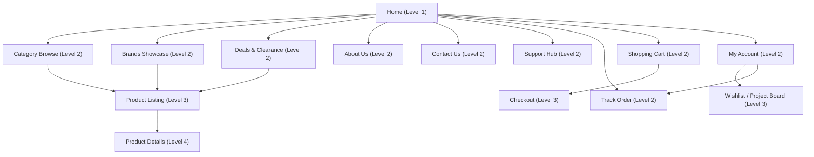
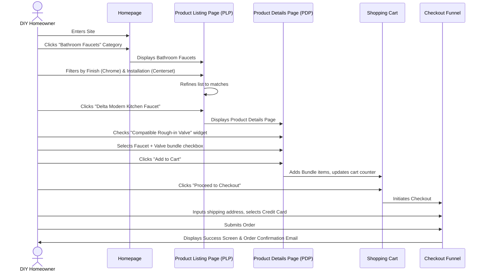
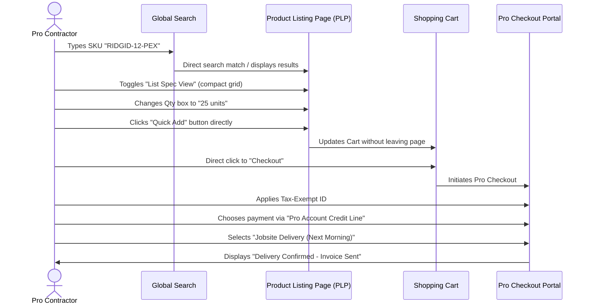

# B2C Plumbing Supply eCommerce Website (Maa Sharde) - Information Architecture

---

## 1. Sitemap & Page Directory

---

## 2. Navigation Architecture

### 2.1 Utility Navigation (Height: 40px, Dark Muted Background)
* **Goal**: Highlight key trust points and secondary operational page entries.
* **Layout (Left-to-Right)**:
  * **Trust Tagline**: "Free Shipping on Orders over $150 | Store Locator" (Icon + Text)
  * **Link Index**: [About Us] | [Track Order] | [Customer Support] | [Contact Us]

### 2.2 Global Header Navigation (Height: 90px, Main Surface Color)
* **Goal**: Primary branding, search, conversion triggers, and account management.
* **Layout (Left-to-Right)**:
  * **Brand Logo**: "PLUMBING SUPPLY PRO" (with secondary-themed color highlights)
  * **Global Search Box**: Integrated "Category Select" dropdown + input text search + [Search Icon] submit button.
  * **Phone Support Info**: "Need Help? 1-800-234-5677" (Bold, professional font).
  * **Action Icons**:
    * **My Account**: Icon + Text label "Account" (Triggers dropdown menu for log-in, profile, orders).
    * **Wishlist**: Icon + Text label "Wishlist" + Badge indicator (count).
    * **Shopping Cart**: Icon + Text label "Cart" + High-contrast Badge indicator (item count, price summary).

### 2.3 Category Bar (Height: 56px, Deep Primary Background)
* **Goal**: Structural browsing and product categorization.
* **Layout (Left-to-Right)**:
  * **Mega Menu Toggle Button**: "SHOP BY CATEGORY" (with grid icon, dropdown arrow).
  * **Main Links**: [Kitchen] | [Bathroom] | [Pipes & Fittings] | [Water Heaters] | [Valves & Accessories] | [Tools & Brands].
  * **Action Link (Right-aligned)**: "DEALS" (high-contrast orange font + sale badge icon).

### 2.4 Footer Navigation (Tonal Surface Dark Background)
* **Goal**: Comprehensive catalog index and legal declarations.
* **Structure (5 Columns)**:
  * **Column 1 (Corporate)**: Brand logo, 2-line description, social media icons, certifications.
  * **Column 2 (Shop)**: Kitchen, Bathroom, Pipes & Fittings, Water Heaters, Tools, All Categories.
  * **Column 3 (Customer Service)**: Contact Us, Shipping Info, Returns, FAQ, Size Guides.
  * **Column 4 (My Account)**: Profile Details, Order History, Invoices, Wishlists, Newsletter Signup.
  * **Column 5 (Contact Details)**: Toll-Free Phone, Email, HQ Location Address, Business Hours.
  * **Bottom Copyright Strip**: Legal copyright notice, links to Privacy Policy, Terms of Service, and XML Sitemap.

---

## 3. Page Hierarchy Levels

| Level | Description | Key Focus | Primary Pages |
| :--- | :--- | :--- | :--- |
| **Level 1** | Entry Pages | Engagement, Search, Identity | Homepage |
| **Level 2** | Department & Core Hubs | Directional choice, Navigation, Branding | Category Browse, Brands, Deals, About, Contact, Support, Track Order, Cart, My Account |
| **Level 3** | Filtering & Collection Lists | Faceted search, List review, Quick comparison | Product Listing Page (PLP), Wishlist/Project Boards, Checkout Page |
| **Level 4** | Product Final details | High-detail specification sheets, compatibility checking | Product Details Page (PDP) |

---

## 4. User Flow Diagrams

### 4.1 B2C Homeowner Faucet Checkout Flow
This flow represents a consumer landing on the home page, researching a faucet, ensuring compatibility, and completing a standard purchase.

### 4.2 Pro Contractor SKU Bulk Procurement Flow
This flow details a contractor utilizing the platform on a job site to order bulk items quickly using SKU search and Pro account credits.

